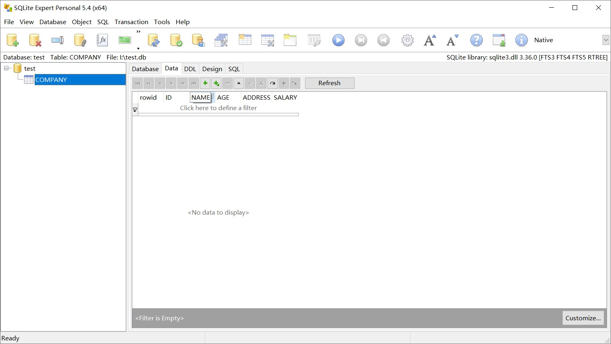
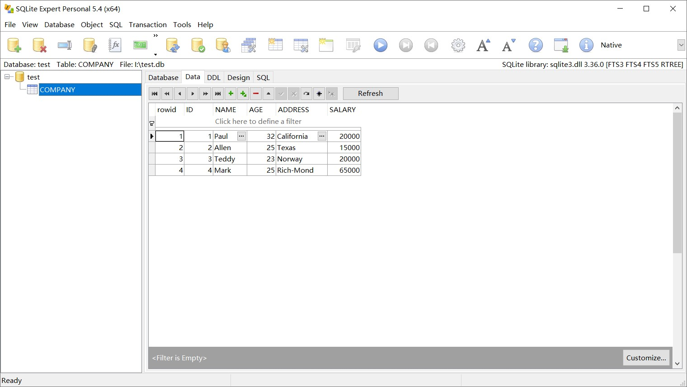
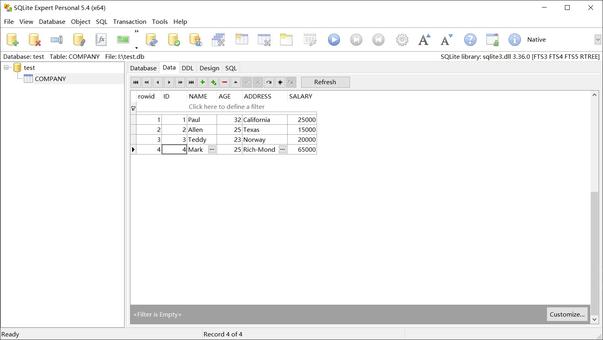
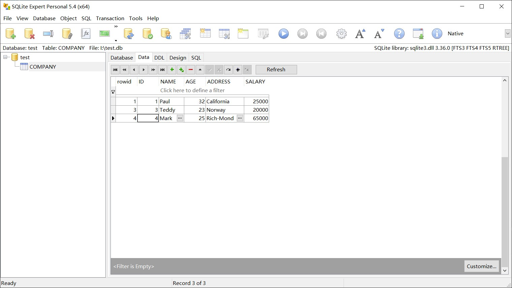

# 创建数据库
## 代码
``` python
#创建数据库
conn = sqlite3.connect('I:/test.db')
print ("Opened database successfully","\n")
c = conn.cursor()
```

---

# 创建表格
## 代码
``` python
#创建表格
c.execute('''CREATE TABLE COMPANY
       (ID INT PRIMARY KEY     NOT NULL,
       NAME           TEXT    NOT NULL,
       AGE            INT     NOT NULL,
       ADDRESS        CHAR(50),
       SALARY         REAL);''')
print ("Table created successfully","\n")
conn.commit() 
```
## 效果


---

# 插入数据
## 代码
``` python
#插入数据
c.execute("INSERT INTO COMPANY (ID,NAME,AGE,ADDRESS,SALARY) \
      VALUES (1, 'Paul', 32, 'California', 20000.00 )")
c.execute("INSERT INTO COMPANY (ID,NAME,AGE,ADDRESS,SALARY) \
      VALUES (2, 'Allen', 25, 'Texas', 15000.00 )")
c.execute("INSERT INTO COMPANY (ID,NAME,AGE,ADDRESS,SALARY) \
      VALUES (3, 'Teddy', 23, 'Norway', 20000.00 )")
c.execute("INSERT INTO COMPANY (ID,NAME,AGE,ADDRESS,SALARY) \
      VALUES (4, 'Mark', 25, 'Rich-Mond ', 65000.00 )")
conn.commit()
print ("Records created successfully","\n") 
```
## 效果


---

# 查询数据
## 代码
``` python
#查询数据
cursor = c.execute("SELECT id, name, address, salary  from COMPANY")
for row in cursor:
   print ("ID = ", row[0])
   print ("NAME = ", row[1])
   print ("ADDRESS = ", row[2])
   print ("SALARY = ", row[3])
print ("Operation done successfully","\n") 
```

---

# 更改数据
## 代码
``` python
c.execute("UPDATE COMPANY set SALARY = 25000.00 where ID=1")
conn.commit()
print ("Total number of rows updated :",conn.total_changes,"\n")  
```
## 效果


---

# 删除数据
## 代码
``` python
c.execute("DELETE from COMPANY where ID=2;")
conn.commit()
print ("Total number of rows deleted :",conn.total_changes,"\n")
conn.close() 
```
## 效果
